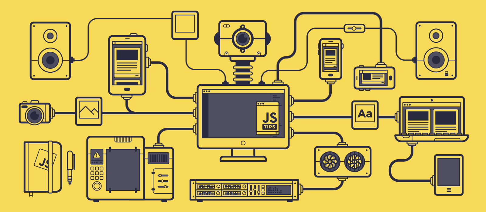

<h1 align="center">Hi 👋 I'm Md. Shahin Hossain.</h1>
<h2 align="center">A passionate Frontend developer from Bangladesh.</h2>
 

<h3 align="center">I'm Shahin Hossain. I'm a Frontend Focused MERN Stack Developer☀️. I describe myself as a passionate developer who loves coding, open source, and the web platform ❤️.

Aside from my job, I like to create and contribute to open source projects. That helps me to learn a ton of new stuff, grow as a developer, and support other open source projects. Also, I enjoy learn new things in my spare time.</h3>

<h1>&nbsp;Current Stats</h1>
 

 

 

- 🔭 I’m currently working on my Personal Project.

- 💬 Ask me about **React, JavaScript**

- 📄 Know about my experiences [My Update Resume](https://drive.google.com/file/d/1H_1gnJtZPPmx0iU6zrWi6RQD3lH5S91s/view)

- 📫 How to reach me **shahin.hossain.dev@gmail.com**

- 🌱 I’m currently learning **Next.js**

<h1>&nbsp;Connect with me</h1>
 

<h1>&nbsp;Technologies that I know</h1>

 

           

 
